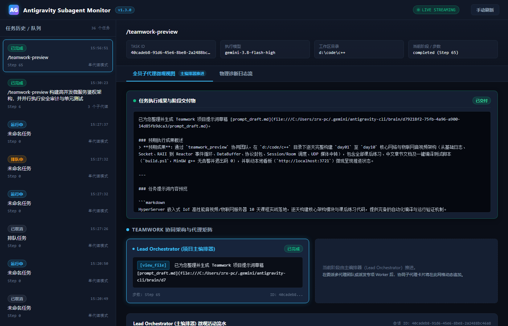

# Codex Antigravity Subagent MCP

[](https://github.com/zamatewi-cell/antigravity-subagent-mcp/actions/workflows/ci.yml)
[](https://nodejs.org/)
[](https://modelcontextprotocol.io/)
[](https://antigravity.google/)
[-success.svg)](#)
[](LICENSE)

> **项目状态：Final GA（v1.5.3 状态完全可信与看板视图稳健修复版）**  
> 本项目已全面解决用户复测报告抓出的 4 项残留真问题（stream 模式深层子代理变动穿透 SSE 指纹广播 `job_updated`、前端快照防覆盖用户自定义筛选/分页视图、按持久化唯一标识 `selectedSubagentId` 锚定子代理与 DAG 节点彻底根除换人失焦、`BUT_NOT_FINISHED` 转折分句未闭环一票否决规则），离线 11 套回归套件与 23 项专项反例 100% 成功通过，生产目录 105 个文件零污染。

---

## ⚡ 5 分钟快速上手 (Quick Start)

通过本指南，你可以在 5 分钟内将 Google Antigravity 的高并发级联 Agent 能力无缝集成到你的 Codex 工作流中。

```text
Codex (LLM / IDE)
   │
   ├─ stdio (MCP Protocol)
   │
Codex Antigravity Subagent MCP (node src/server.mjs)
   │
   ├─ Dual-Track Process Supervisor (Print / Stream NDJSON)
   ├─ Real-time God's-eye Dashboard (HTTP :3721 / SSE)
   │
Google Antigravity CLI (agy)
   │
Gemini 3.8 Flash High (Multi-Agent Swarm / Teamwork)
```

---

### 第一步：准备基础环境

在使用本 MCP 前，请确保本机已具备以下环境：
- **Node.js**：`>= 20.0.0`（推荐 Node 20 LTS 或 Node 22）
- **Git**：用于拉取代码
- **Codex**：正常安装与配置
- **Google Antigravity CLI (`agy`)**：Google 官方代理终端

---

### 第二步：安装与授权 Google Antigravity CLI

根据你的操作系统，使用官方一键脚本安装 `agy`：

#### Windows (PowerShell)：
```powershell
irm https://antigravity.google/cli/install.ps1 | iex
```
> **Windows 默认安装路径**：`%LOCALAPPDATA%\agy\bin`（即 `C:\Users\<用户名>\AppData\Local\agy\bin`）。

#### macOS / Linux (Bash/Zsh)：
```bash
curl -fsSL https://antigravity.google/cli/install.sh | bash
```

#### 首次登录与信任验证：
安装完成后，在终端运行一次 `agy` 完成浏览器登录并信任工作区：
```bash
# 验证版本
agy --version

# 首次运行并完成浏览器登录授权
agy
```

---

### 第三步：克隆 MCP 仓库与离线自测

将本项目克隆到本地目录（以 `C:\Tools\antigravity-subagent-mcp` 或 `~/Tools/...` 为例）：

```bash
# 1. 克隆仓库
git clone https://github.com/zamatewi-cell/antigravity-subagent-mcp.git
cd antigravity-subagent-mcp

# 2. 安装依赖 (严格基于 package-lock.json 对齐)
npm ci

# 3. 运行全量离线自动化测试套件 (11 门单测聚合)
npm run test:offline
```
> 若看到 11 套测试全部绿色通过（`All Tests Passed`），说明 Node.js 依赖、MCP 本地组件及离线回归测试正常（AGY CLI 凭据与模型连通性由后续步骤验证）。

---

### 第四步：配置接入 Codex

你可以选择**命令行快速添加**或**编辑配置文件（强烈推荐）**。

#### 方式 A：命令行快速添加（CLI）
在终端中执行：
```bash
# Windows 示例（请替换为你本机的实际仓库路径）
codex mcp add antigravity-subagent -- node "C:\Tools\antigravity-subagent-mcp\src\server.mjs"

# macOS / Linux 示例
codex mcp add antigravity-subagent -- node "/path/to/antigravity-subagent-mcp/src/server.mjs"
```

#### 方式 B：直接编辑 `config.toml`（推荐，最稳妥方案）
在 Codex 配置文件 `~/.codex/config.toml` 中追加如下配置。**明确指定 `AGY_CLI_PATH` 可以彻底杜绝因环境变量 PATH 缺失导致的寻址失败**：

```toml
[mcp_servers.antigravity-subagent]
command = "node"
args = ["C:\\Tools\\antigravity-subagent-mcp\\src\\server.mjs"]

[mcp_servers.antigravity-subagent.env]
# 显式指定 agy.exe 绝对路径（Windows 官方默认安装路径示例如下）
AGY_CLI_PATH = "C:\\Users\\YOUR_USERNAME\\AppData\\Local\\agy\\bin\\agy.exe"
# 默认使用 auto-approve 模式，确保无头执行时工具调用免人工交互阻塞
ANTIGRAVITY_PERMISSION_MODE = "auto-approve"
# 默认模型（可选，默认 gemini-3.8-flash-high）
ANTIGRAVITY_DEFAULT_MODEL = "gemini-3.8-flash-high"
```

---

### 第五步：验证连通性

打开 Codex，输入 `/mcp` 即可查看已配置的 MCP 工具列表。随后向 Codex 发送指令进行连通性自检：

> **提示词示范**：  
> “检查 antigravity-subagent MCP 是否可用，调用 `antigravity_status`，告诉我当前 AGY CLI 版本、默认模型以及运行状态。”

如果配置正常，Codex 会调用 `antigravity_status` 并返回真实的就绪结构：
```json
{
  "status": "READY",
  "cli_path": "C:\\Users\\...\\AppData\\Local\\agy\\bin\\agy.exe",
  "cli_version": "1.x.x",
  "default_model": "gemini-3.8-flash-high",
  "default_model_available": true,
  "default_permission_mode": "auto-approve",
  "models": [
    "gemini-3.8-flash-high",
    "gemini-3.8-pro",
    "..."
  ],
  "agents": ["..."],
  "errors": []
}
```

---

### 第六步：核心使用场景实战

现在你可以随心所欲地让 Codex 调度 Gemini 多代理团队协同工作：

#### 场景 1：普通单次委派任务（代码审查 / 独立分析）
> **你对 Codex 说**：  
> “把当前仓库代码交给 Gemini 做一次深度代码审查，重点排查潜在并发漏洞与未处理异常，只出具报告不要修改源码。”  
> *(Codex 将自动调用 `delegate_to_gemini` 并实时返回执行进度)*

#### 场景 2：启动大型长任务或 Teamwork 多代理集群
> **你对 Codex 说**：  
> “在后台拉起 Gemini 任务，使用 `/teamwork-preview` 对当前项目做一次完整架构、安全与测试审计。”  
> *(Codex 将调用 `start_gemini_task` 生成任务 ID，由 Project Sentinel、Top Orchestrator 与多个 Worker 级联并行推进)*

#### 场景 3：双向交互流传输（Interactive HITL 多轮会话）
> **你对 Codex 说**：  
> “以 stream 模式启动一个 Gemini 交互任务，先给出重构方案，等我确认后再继续写代码。”  
> *(走 `start_gemini_task(session_mode="stream")` → 收到第一轮回复 → `interact_gemini_task` 注入第二轮提示 → `finish_gemini_task` 优雅结束并收敛为 success)*

#### 场景 4：一键唤起上帝视角监控看板
> **你对 Codex 说**：  
> “打开 Antigravity 监控看板。”  
> *(Codex 将调用 `open_dashboard` 并在默认浏览器弹出 `http://localhost:3721`)*

---

## 🖥️ 实时可视化监控看板 (Visual Dashboard)

本项目内置纯原生零外部依赖（Zero External Dependencies）的暗黑极客风 Web 监控看板：



### 看板核心特性：
1. **微观上帝视角网格**：主编排器（Orchestrator）、子代理矩阵（Workers）、审计员（Auditor）全员卡片网格，实时展示各 Agent 当前步数、微观动作描述与激活工具标签（如 `[run_command]`、`[write_to_file]`）。
2. **原生 SVG Agent DAG 拓扑连线**：纯原生 HTML5/SVG 渲染父子调用拓扑，搭载硬件加速的 CSS 霓虹流光动画（`wireFlow` / `wireBreath`），直观呈现 Agent 编排层级。
3. **SSE 增量差异广播**：利用服务端事件流（`/api/stream`）推送细粒度变更（`job_created`, `job_updated`, `job_removed`），前端内存字典局部打补丁，彻底杜绝高频全量 JSON 广播带来的网络浪费与重绘卡顿。
4. **历史任务分页与检索**：支持按任务状态（`running`、`success`、`error` 等）精确过滤，支持关键词和 Job ID 毫秒级检索。
5. **人机软介入（HITL）控制台**：在网页端直接向运行中子进程 stdin 注入按键或指令（快捷键 `[Y]`、`[N]`、`[Enter]`），支持一键安全终止与优雅结束。

启动方式：
- **MCP 联动模式**：设置环境变量 `ANTIGRAVITY_ENABLE_DASHBOARD=1`，或通过 MCP 工具 `open_dashboard`。
- **独立进程模式**：直接运行 `npm run dashboard`（支持 `--port <port>` 与 `--open`）。

---

## 🛠️ MCP 工具清单与接口契约

Codex 连接本服务后，将获得以下 8 个高内聚工具：

| 工具名称 | 读写属性 | 核心功能与使用说明 |
| :--- | :---: | :--- |
| **`delegate_to_gemini`** | 写入/执行 | **同步/准实时委托**：阻塞执行并定期（每 2s）通过 `progressToken` 向 Codex 推送最新步数与微观动作。 |
| **`start_gemini_task`** | 写入/执行 | **异步后台启动**：立即返回全局唯一 `job_id`，支持 `session_mode: "stream"` 激活流式长会话。 |
| **`get_gemini_task`** | 只读查询 | **进度轮询与探查**：获取任务最新状态、详细进度对象 `progress`、子代理拓扑与诊断日志截取。 |
| **`interact_gemini_task`** | 写入/交互 | **HITL 人机交互介入**：向运行中的长会话注入第二轮输入，支持 `end_session: true` 单步结束。 |
| **`finish_gemini_task`** | 写入/控制 | **会话优雅收官**：关闭 stream 任务的输入管道，等待子进程退出并稳定收敛至 `success` 终态。 |
| **`cancel_gemini_task`** | 写入/控制 | **统一任务取消**：原子取消 `queued` 排队任务或 `running` 运行中任务，物理清理跨平台进程树。 |
| **`antigravity_status`** | 只读查询 | **环境探查诊断**：快速检测本机 `agy` 路径、版本号、默认模型可用性及看板状态。 |
| **`open_dashboard`** | 只读辅助 | **浏览器唤起**：确保看板服务在线并自动调用系统默认浏览器打开 `http://localhost:3721`。 |

---

## 🛡️ 架构设计与系统硬化亮点

```text
┌──────────────────────────────────────────────────────────────────────────────┐
│                    Codex Antigravity Subagent MCP Engine                     │
├──────────────────────────────────┬───────────────────────────────────────────┤
│ 1. 双轨执行架构 (Dual-Track)       │ 2. 动态双层解析架构 (Two-Tier Transcript)    │
│    - Batch Print (--print=...)   │    - parseLocalTranscript: 静态解析真 LRU │
│    - Stream NDJSON (bidirect)    │    - composeAgentTree: 实时动态拓扑装配   │
├──────────────────────────────────┼───────────────────────────────────────────┤
│ 3. 生命周期统一状态机            │ 4. 纵深防御与安全控制                     │
│    - 首发终止原因胜出保护        │    - 独立看板 HTTP 409 防篡改只读拦截     │
│    - 严防 completed 误判与漂移   │    - Host 白名单与非本地 Origin 403 阻断  │
│    - 同目录串行互斥锁 (AsyncLock)│    - 物理日志凭据（Bearer/Token）脱敏     │
└──────────────────────────────────┴───────────────────────────────────────────┘
```

1. **双轨执行架构（Dual-Track）**：
   - 自动化/流水线委托保持极稳的 `--output-format json --print=<prompt>` 轨道；
   - 交互长会话无缝接入官方 `--input-format stream-json --output-format stream-json` 轨道，使用 `StreamLineParser` 解决 TCP 粘包与断行恢复。
2. **两层 Transcript 解析架构**：
   - 底层 `parseLocalTranscript` 负责单文件语法静态解析与真 LRU 缓存管理；
   - 上层 `composeAgentTree` 动态递归遍历子代理目录结构，彻底解决“父 transcript 不变导致子 Agent 状态冻结”的历史顽疾。
3. **工作区目录串行锁（`withDirectoryLock`）**：
   - 同一工作目录并发委托自动排队互斥，杜绝并发 Antigravity 实例引发的文件读写冲突；不同工作目录完全并发。
4. **严格的只读与安全防护机制**：
   - 独立运行的看板进程（无内存句柄时）严禁通过 REST API 伪造取消或注入输入（一律拦截并返回 `HTTP 409 Conflict`）；
   - 严格防御 DNS Rebinding 与 CSRF 攻击，仅放行受信任本地请求（`localhost` / `127.0.0.1`）。

---

## ❓ 常见问题排错 (Troubleshooting)

### Q1: `antigravity_status` 报告 `ready: false` 或找不到 CLI 路径？
- **原因**：`agy.exe` 未在系统 `PATH` 环境变量中，或安装在非标准路径。
- **解决**：在 `~/.codex/config.toml` 中显式配置 `AGY_CLI_PATH` 为绝对路径，例如：
  `AGY_CLI_PATH = "C:\\Users\\YOUR_NAME\\AppData\\Local\\agy\\bin\\agy.exe"`。

### Q2: 任务执行时提示工具权限被拒绝（`TOOL_CONFIRMATION_DENIED`）？
- **原因**：Antigravity 默认在需要执行终端或写入文件时弹出确认提示，无头（Headless）运行中无法交互确认。
- **解决**：确保环境变量 `ANTIGRAVITY_PERMISSION_MODE="auto-approve"`（本项目默认值），该模式会在底层自动注入 `--dangerously-skip-permissions`。

### Q3: 首次调用时提示认证失败或阻塞？
- **原因**：Google Antigravity CLI 尚未完成初始授权或工作区信任。
- **解决**：打开系统原生命令行，直接输入 `agy` 回车，按照浏览器指引完成一次授权，并对当前工作目录执行 `/trust`。

---

## 🧪 离线与端到端自动化测试验证

本项目包含完善的自动化测试基础设施，涵盖 11 套单测与端到端套件：

```bash
# 执行全部 11 门离线回归套件（沙箱隔离，零生产数据污染）：
npm run test:offline

# 独立单测执行：
node test/hitl-stream-transport.test.mjs  # 交互式流协议与优雅结束单测 (8/8 PASS)
node test/hitl-real-agy.e2e.test.mjs      # 真实 AGY 进程物理 E2E 验证 (PASS)
node test/pagination.test.mjs             # 历史任务分页过滤单测 (12/12 PASS)
node test/sse-delta.test.mjs              # SSE 细粒度增量广播单测 (7/7 PASS)
node test/dag-topology.test.mjs           # 原生 SVG DAG 拓扑单测 (4/4 PASS)
node test/hitl.test.mjs                   # 软介入与 EPIPE 防崩安全单测 (9/9 PASS)
node test/cancel-consistency.test.mjs     # 统一取消与防漂移单测 (6/6 PASS)
node test/counterexamples.test.mjs        # 深度反例与状态防伪单测 (18/18 PASS)
node test/dashboard.test.mjs              # Web 看板 REST/SSE 接口单测 (7/7 PASS)
node test/lifecycle.test.mjs              # 生命周期离线验证单测 (PASS)
node test/progress.test.mjs               # 进度解析与持久化单测 (PASS)
node test/diagnostics.test.mjs            # 诊断日志脱敏与错误分析单测 (PASS)
```

---

## 📜 详细版本变更历史 (Changelog)

<details>
<summary><b>展开查看 v1.0.3 ~ v1.5.1 完整演进记录</b></summary>

### Version 1.5.1 (Feature Freeze Final Release):
- **Graceful Stream Session Termination (`finish_gemini_task`)**:
  - Added official MCP tool `finish_gemini_task(job_id)` and Dashboard endpoint `POST /api/jobs/:id/finish`, allowing clients and operators to gracefully terminate long-running stream sessions by safely invoking `stdin.end()` and awaiting exit completion.
  - Enhanced `interact_gemini_task` with `end_session: boolean (default: false)` to send a final instruction and immediately close the input stream in a single step.
- **Stream Exit State Machine Decoupling**:
  - Decoupled process close handling in stream mode from single-turn `parseAgyJson`. Directly leverages stream-parsed `lastTurnResult`, preventing NDJSON `{"event": "result"}` wrappers from corrupting task status and ensuring clean convergence to `state: "success"`.
- **Production MCP Real-AGY E2E Verification**:
  - `test/hitl-real-agy.e2e.test.mjs` rewritten to connect directly as a live MCP client through `src/server.mjs`, validating the complete lifecycle (`start_gemini_task` -> `interact_gemini_task` -> `finish_gemini_task`) with actual AGY binaries and exit code 0.

### Version 1.5.0:
- **Interactive Stream Transport & Native Multi-Turn HITL Closure**:
  - **Dual-Track Execution Architecture**: Retains the rock-solid one-off delegation track (`--output-format json --print=<prompt>`) for batch automation, while introducing the official Headless Streaming channel (`--input-format stream-json --output-format stream-json --dangerously-skip-permissions`) activated via `session_mode: "stream"`.
  - **NDJSON Stream Protocol Parser & Framing**: Implemented `StreamLineParser` in `src/stream-transport.mjs` to reliably handle chunk fragmentation, line-boundary recovery, and TCP socket packet coalescing. Standardized input packaging via `encodeStreamUserMessage` adhering strictly to official Headless NDJSON event schema (`{"event": "user", "message": {"content": "..."}}`).
  - **Live Handshake & Conversation Tracking**: Intercepts `event: init` to immediately extract the genuine backend `conversation_id` (`job.conversationId`), continuously digests `step_update` to stream text deltas, and handles `result` to increment multi-turn counters (`numTurns`).
  - **Persistent Session HITL Pipeline**: Upgraded `sendInputToJob` and Dashboard `POST /api/jobs/:id/interact` to directly inject structured NDJSON into running child processes, enabling persistent multi-turn conversations in the same child process without restarting CLI or creating disjoint sessions.
  - **New MCP Tool `interact_gemini_task`**: Directly exposed to MCP clients for orchestrating interactive conversations with long-running subagents.
  - **Real AGY End-to-End Test Suite**: Validated full physical round-trip on actual local hardware with `D:\Antigravity\agy\bin\agy.exe` (`test/hitl-real-agy.e2e.test.mjs`), confirming prompt -> response -> Web interaction injection -> turn 2 response -> graceful exit (`Exit Code: 0`).

### Version 1.4.0:
- **Historical Jobs Pagination & Multidimensional Filtering (R1)**:
  - Added query parameter parsing to `GET /api/jobs` supporting `page` (default: 1), `limit` (default: 20, clamped to 1-100), `state` exact filtering, and `search` substring search matching prompt and job ID.
  - Standardized paginated response structure `{ data: Job[], pagination: { total, page, limit, totalPages, hasMore } }` with transparent backward-compatibility for unparameterized requests.
- **Single-Job Replacement SSE Event Streaming & Lightweight Snapshots (R2)**:
  - Re-architected `GET /api/stream` to dispatch initial lightweight `snapshot` (all active jobs + recent 20 terminal jobs, offloading deep history to REST pagination) with incrementing cursor `seq`.
  - Upgraded differential change detection from full-list broadcast to single-job entity replacement (`job_created`, `job_updated`, `job_removed`), sending lightweight `:keep-alive` comments during idle intervals.
  - Hardened `getJobFingerprint` to deeply serialize subagent status, step, current action, last tool, and topology tree, ensuring subagent-only micro-activities immediately trigger live streaming updates.
- **Native Zero-Dependency SVG Agent DAG Topology (R3)**:
  - Augmented recursive agent tree assembly with directional topological metadata (`parentId`, `depth`, `childrenIds`, `nodeType`).
  - Rendered compact hierarchical DAG visualizer using a dual-layer architecture: underlying SVG cubic Bézier flowing wires with pure CSS hardware-accelerated neon breathing keyframes (`wireFlow`, `wireBreath`), and top-layer absolute HTML interactive cards.
- **Experimental Human-in-the-loop (HITL) Soft Intervention Pipeline (R4)**:
  - Configured child process spawn with `stdio: ["pipe", "pipe", "pipe"]` as an experimental bidirectional stream channel designed for stream protocol interactions (`--input-format stream-json`).
  - Implemented asynchronous `sendInputToJob` with physical write confirmation callbacks, newline auto-completion, and robust EPIPE / pipe-destruction crash guards.

### Version 1.3.3:
- Two-tier transcript parser architecture resolving worker cache freezing.
- Decoupled `src/directory-lock.mjs` module.
- Memory bounding with genuine LRU eviction on transcript and disk caches.
- Multi-OS GitHub Actions CI workflow (`.github/workflows/ci.yml`).

### Version 1.3.2:
- Strict standalone monitor readonly protection (HTTP 409 Conflict).
- Subagent state priority realignment (`killed` status permanence).
- CSRF & DNS Rebinding protection (Host header whitelisting & Origin 403).

### Version 1.3.1:
- DOM-based XSS elimination via HTML entity escaping.
- Tightened CORS headers, physical log tail sanitization, earliest termination reason protection.

### Version 1.3.0:
- Standalone real-time visual monitor dashboard with God's-eye View Grid.
- Micro-activity timeline and zero-polling SSE push.
- New MCP tool `open_dashboard`.

### Version 1.2.2:
- Complete negation and in-progress defense in lifecycle evaluation.
- Queued task cancellation and restart convergence.

### Version 1.2.1:
- Strict evidence-based lifecycle evaluation.
- Working MCP progress notification stream via `ctx.mcpReq.notify`.
- Asynchronous per-workspace serialization directory lock.

### Version 1.2.0:
- Deep cascade subagent transcript penetration for spawned Teamwork workers.

### Version 1.1.0:
- Real-time progress and activity tracking with lightweight job persistence.

### Version 1.0.3:
- Credential redaction in diagnostic logs and cross-platform process tree cleanup.
</details>

---

## 📄 开源许可证

本项目基于 [MIT License](LICENSE) 开源。欢迎提交 Issue 与改进建议！
